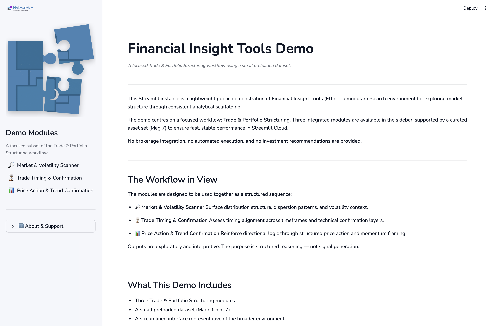
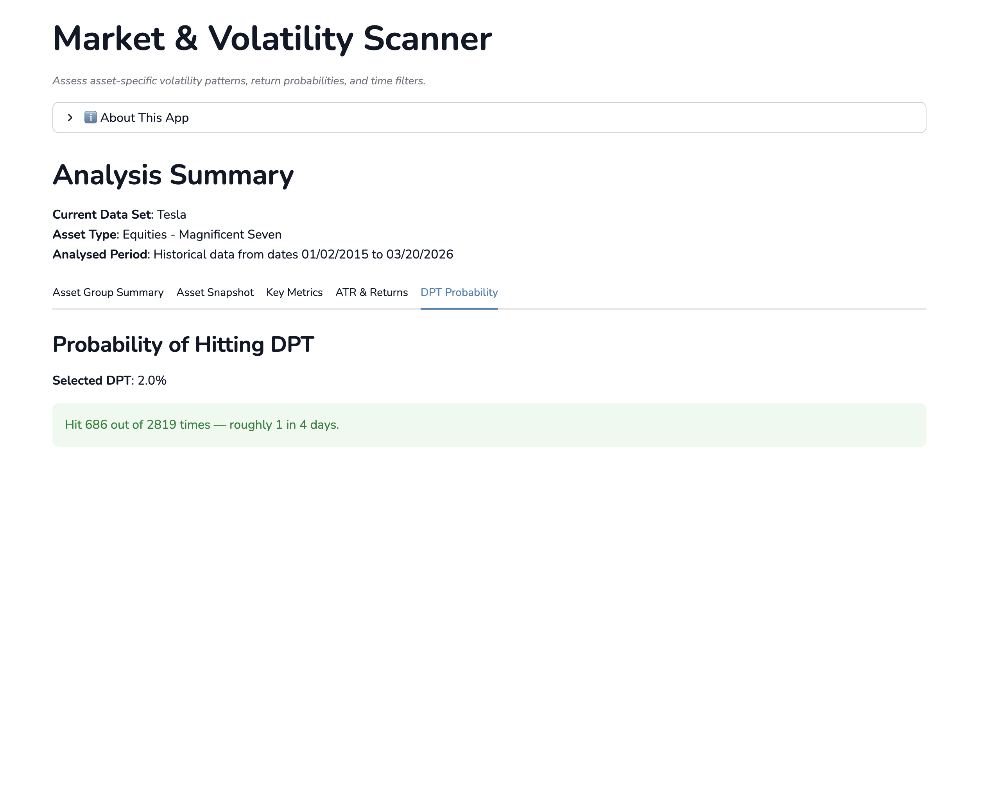
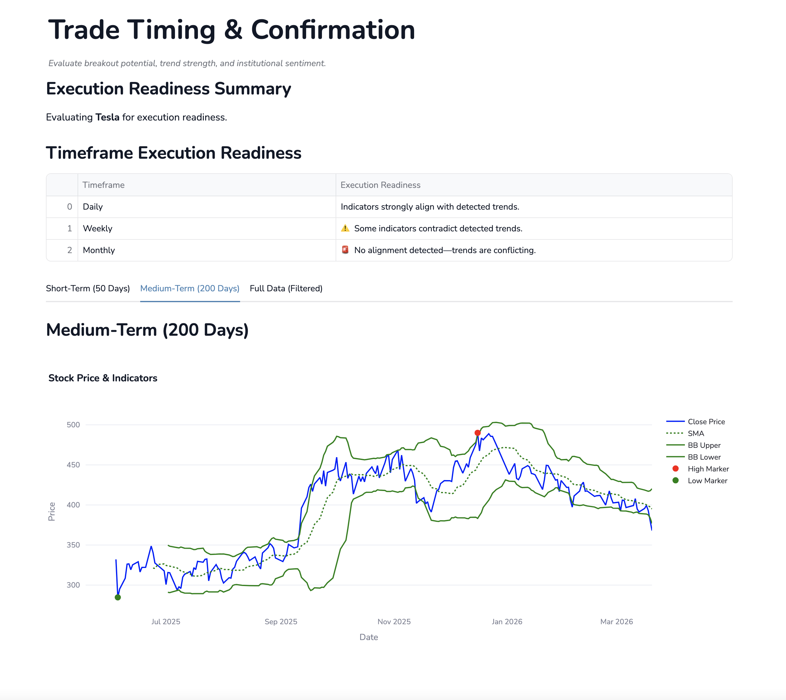
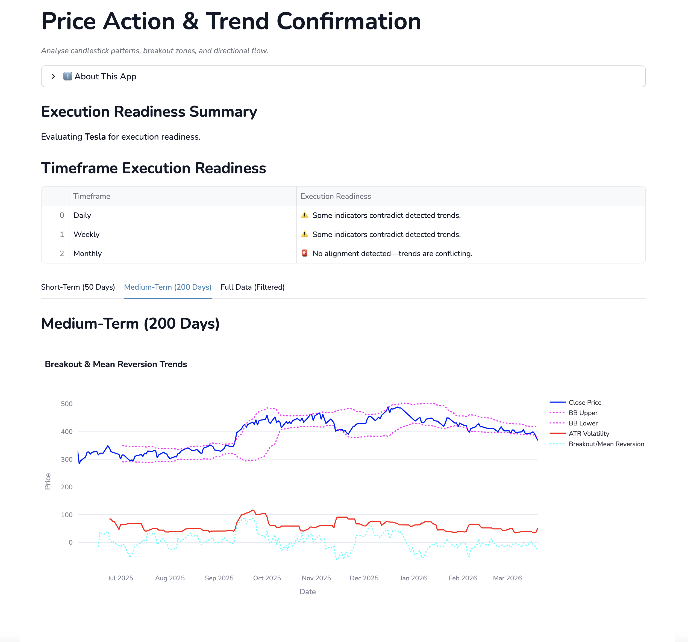

# Financial Insight Tools (FIT) — Public Demo

Financial Insight Tools (FIT) Demo is a focused Streamlit preview of the Trade & Portfolio Structuring layer within the broader Financial Insight Tools research environment.

This repository presents a streamlined subset of the system, designed to demonstrate structural analysis workflows without exposing the full modular architecture.

---

## Scope of This Demo

The demo includes three integrated modules:

- **Market and Volatility Scanner**
- **Trade Timing and Confirmation**
- **Price Action and Trend Confirmation**

The dataset is restricted to a curated selection of large-cap equities (Magnificent 7) to ensure fast, stable performance.

This demo does not include:

- Cross-asset correlation overlays  
- User-uploaded datasets  
- Observation logging  
- Structured export bundles  
- Macroeconomic exploration modules  
- Portfolio registry management  

The full FIT suite expands into these domains.

---

## What This Is (and Isn’t)

**Is:**  
A structured research environment for exploring market distribution, volatility context, trade timing alignment, and price behaviour using consistent analytical scaffolding.

**Isn’t:**  
A brokerage platform, automated trading system, advisory service, signal engine, or predictive model. No trade execution or financial advice is provided.

All outputs are exploratory and structural in nature.

---

## Python Version

Python 3.11–3.12 (tested on 3.12.x)

---

## Quick Start

### 1. Clone

```bash
git clone https://github.com/blakewiltshire/financial-insight-tools-demo.git
cd financial-insight-tools-demo
```

### 2. Create a Virtual Environment

```bash
python3 -m venv .venv
```

If `python3` is not available on your system, try:

```bash
python -m venv .venv
```

### 3. Activate the Environment

**macOS / Linux**

```bash
source .venv/bin/activate
```

**Windows (PowerShell)**

```powershell
.\.venv\Scripts\Activate.ps1
```

**Windows (cmd)**

```bat
.\.venv\Scripts\activate.bat
```

### 4. Install Requirements

```bash
python -m pip install --upgrade pip
pip install -r requirements.txt
```

### 5. Run the Application

```bash
streamlit run app.py
```

The application will launch at:

http://localhost:8501

---

## Screenshots

### 1. Financial Insight Tools Demo — Overview



The demo homepage provides structural orientation and module navigation within the Trade & Portfolio Structuring workflow.

---

### 2. Market and Volatility Scanner



The scanner surfaces:

- Return distribution structure  
- Dispersion characteristics  
- Volatility context  
- Regime-sensitive framing  

This module provides quantitative grounding for downstream analysis.

---

### 3. Trade Timing and Confirmation



This module examines:

- Timeframe alignment  
- Confirmation layers  
- Structured entry logic  
- Context-aware trade framing  

No automated execution or signal generation is performed.

---

### 4. Price Action and Trend Confirmation



Price behaviour and directional context are examined through:

- Trend structure  
- Momentum framing  
- Pattern consistency  
- Regime-aware interpretation  

Outputs remain exploratory rather than prescriptive.

---

## Repository Structure

```
financial-insight-tools-demo/
  app.py          # Streamlit launcher
  brand/          # Visual assets
  components/     # UX
  core/           # Shared structural logic and helpers
  data_sources/   # Data sources and cleaners
  docs/           # Reference documentation
  helpers/        # Helper files
  images/         # Application images
  pages/          # Application launcher
  use_cases/      # Use Cases
  LICENSE
  README.md
  requirements.txt
```
This repository represents a focused preview layer of the broader Financial Insight Tools architecture.

---

## Relationship to the Full FIT Suite

The full Financial Insight Tools environment extends beyond this demo into:

- Macroeconomic exploration
- Cross-asset correlation mapping
- Portfolio monitoring workflows
- Structured observation capture
- AI-ready export bundles

This repository presents a contained view of the Trade & Portfolio Structuring layer.

---

## License & Use

Free to read and use as provided.

All outputs are structural and exploratory in nature.  
No advisory, brokerage, portfolio management, or automated trading services are provided.

Refer to LICENSE for details.

---

## Ecosystem Context

Financial Insight Tools forms part of a broader independent framework studio exploring complex systems through structured guides, modular tools, and applied research environments.

FIT aligns with the architectural concepts presented in the *Navigating the World of Economics, Finance, and Markets* series — a multi-volume framework examining economics and finance as interconnected systems shaped by institutions, incentives, coordination mechanisms, and technological change.

The full Financial Insight Tools environment extends beyond this demo into macroeconomic exploration, cross-asset mapping, structured observation capture, and AI-ready export workflows.

Further context:  
www.blakewiltshire.com


---

Financial Insight Tools by Blake Wiltshire  
© Blake Media Ltd.
