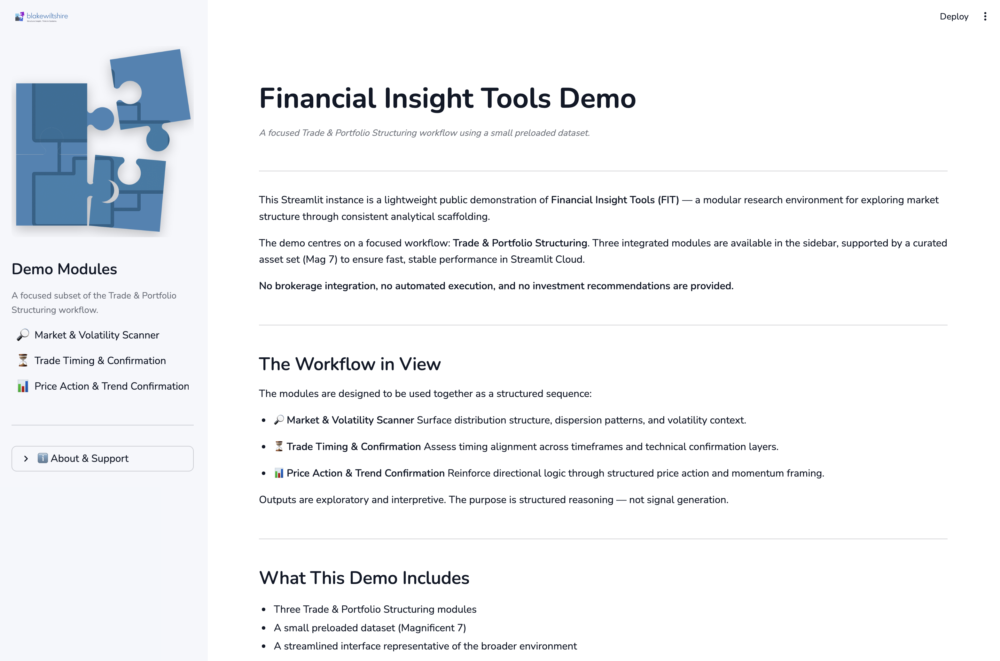
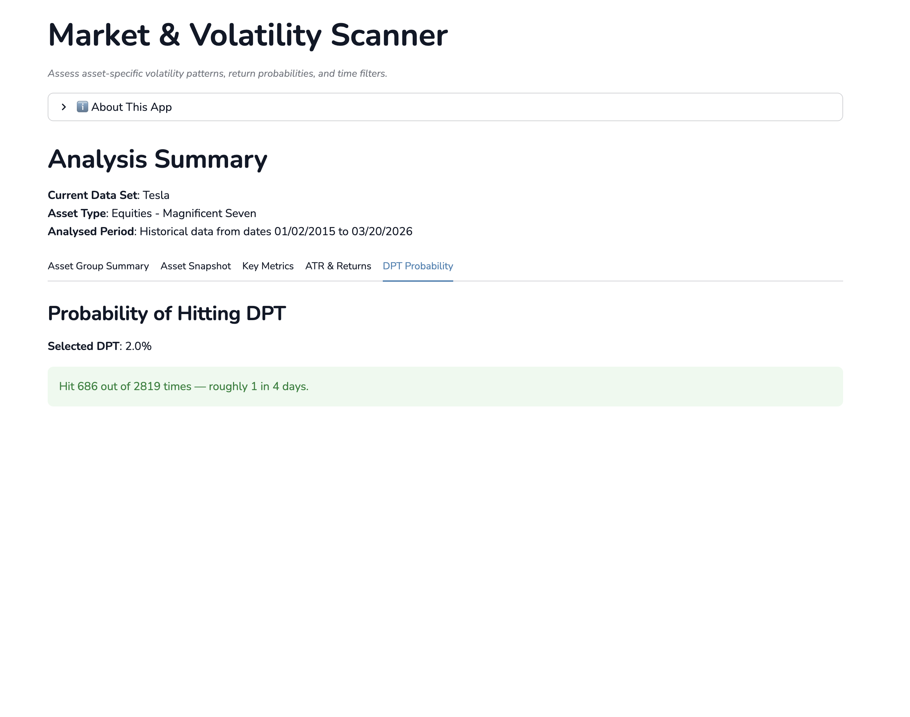
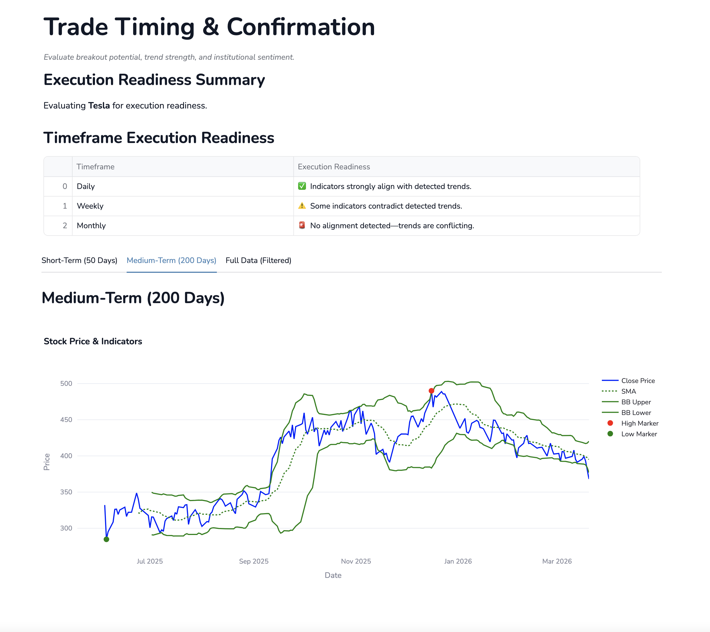
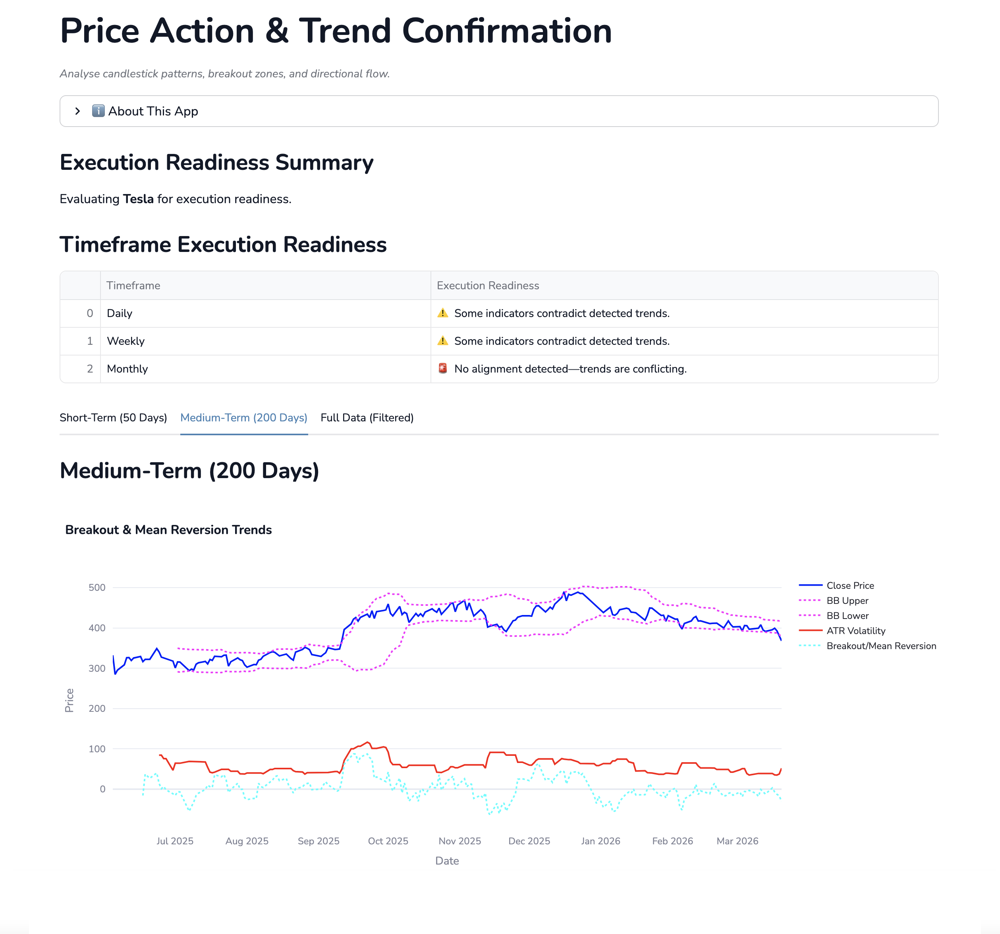

# Financial Insight Tools (FIT) — Public Preview

Financial Insight Tools (FIT) Public Preview is a focused Streamlit view of the Trade & Portfolio Structuring layer within the broader Financial Insight Tools research environment.

This repository presents one contained operational layer of the wider FIT architecture. It demonstrates how structured market analysis can be framed through consistent analytical scaffolding without exposing the full production suite.

---

## Scope of This Preview

The preview includes three integrated modules:

- **Market and Volatility Scanner**
- **Trade Timing and Confirmation**
- **Price Action and Trend Confirmation**

The dataset is restricted to a curated selection of large-cap equities (Magnificent 7) to ensure fast, stable performance.

This preview does not include:

- Thematic Correlation
- Relative Macro Transmission
- Positioning & Crowding
- Cross-asset correlation overlays
- User-uploaded datasets
- Observation logging
- Structured export bundles
- Macroeconomic exploration modules
- Portfolio registry management

The full FIT suite expands into these domains.

---

## Relationship to the Full FIT Suite

The full Financial Insight Tools environment extends across three connected analytical layers.

### System Foundation

- **Economic Exploration**
- **Thematic Correlation**
- **Relative Macro Transmission**
- **Positioning & Crowding**

These modules frame macro conditions, systemic relationships, transmission pathways, and market participation structure.

---

### Financial Application

- **Market & Volatility Scanner**
- **Asset Snapshot Generator**
- **Trade Timing & Confirmation**
- **Price Action & Trend Confirmation**
- **Trade Structuring & Risk Planning**
- **Spread Ratio Insights**
- **Cross Asset Correlation**
- **Live Portfolio Monitor**

These modules apply structural context to scenario analysis, portfolio framing, and market inspection.

---

### Utility & Decision Support

- **Kelly Criterion**
- **VaR Calculator**
- **Compounding Calculator**
- **Standard Deviation Calculator**
- **Historical Data Currency Converter**
- **Data Cleaner & Inspector**
- **Observation Capture**
- **AI-Ready Export Bundles**

These modules support operational consistency, validation, and structured documentation workflows.

This repository provides access to one focused application layer within that broader environment.

It is intentionally limited in scope to preserve clarity, speed, and accessibility while maintaining the same architectural principles used across the full suite.

---

## What This Is (and Isn’t)

**Is:**  
A structured research environment for exploring market distribution, volatility context, trade timing alignment, and price behaviour using consistent analytical scaffolding.

**Isn’t:**  
A brokerage platform, automated trading system, advisory service, signal engine, or predictive model. No trade execution or financial advice is provided.

All outputs are exploratory and structural in nature.

---

## Python Version

Tested on 3.12.x

---

## Quick Start

### 1. Clone

```bash
git clone https://github.com/blakewiltshire/financial-insight-tools-demo.git
cd financial-insight-tools-demo
```

### 2. Create a Virtual Environment

```bash
python3 -m venv .venv
```

If `python3` is not available on your system, try:

```bash
python -m venv .venv
```

### 3. Activate the Environment

**macOS / Linux**

```bash
source .venv/bin/activate
```

**Windows (PowerShell)**

```powershell
.\.venv\Scripts\Activate.ps1
```

**Windows (cmd)**

```bat
.\.venv\Scripts\activate.bat
```

### 4. Install Requirements

```bash
python -m pip install --upgrade pip
pip install -r requirements.txt
```

### 5. Run the Application

```bash
streamlit run app.py
```

The application will launch at:

http://localhost:8501

---

## Screenshots

---

### 1. Financial Insight Tools Preview — Overview



The preview homepage establishes structural orientation and module navigation within the Trade & Portfolio Structuring workflow.

---

### 2. Market and Volatility Scanner



A structural view across market behaviour and volatility conditions:

- Return distribution structure
- Dispersion characteristics
- Volatility context
- Regime-sensitive framing

Provides quantitative grounding for downstream analysis.

---

### 3. Trade Timing and Confirmation



A structured view across timing and confirmation layers:

- Timeframe alignment
- Confirmation layers
- Entry structure
- Context-aware framing

No automated execution or signal generation is performed.

---

### 4. Price Action and Trend Confirmation



A structural view across price behaviour and directional context:

- Trend structure
- Momentum framing
- Pattern consistency
- Regime-aware interpretation

Outputs remain exploratory rather than prescriptive.

---

## Repository Structure

```text
financial-insight-tools-demo/
  app.py          # Streamlit launcher
  brand/          # Visual assets
  components/     # UX
  core/           # Shared structural logic and helpers
  data_sources/   # Data sources and cleaners
  docs/           # Reference documentation
  helpers/        # Helper files
  images/         # Application images
  pages/          # Application launcher
  use_cases/      # Use Cases
  LICENSE
  README.md
  requirements.txt
```

This repository represents a focused preview layer of the broader Financial Insight Tools architecture.

---

## License & Use

Free to read and use as provided.

All outputs are structural and exploratory in nature.  
No advisory, brokerage, portfolio management, or automated trading services are provided.

Refer to LICENSE for details.

---

## Ecosystem Context

Financial Insight Tools forms part of a broader independent framework studio exploring complex systems through structured guides, modular tools, and applied research environments.

FIT aligns with the architectural concepts presented in the *Navigating the World of Economics, Finance, and Markets* series — a multi-volume framework examining economics and finance as interconnected systems shaped by institutions, incentives, coordination mechanisms, and technological change.

The full Financial Insight Tools environment extends beyond this public preview into macroeconomic exploration, thematic correlation, relative macro transmission, positioning analysis, cross-asset mapping, structured observation capture, and AI-ready export workflows.

Further context:  
https://blakewiltshire.com

---

Financial Insight Tools by Blake Wiltshire  
© Blake Media Ltd.
