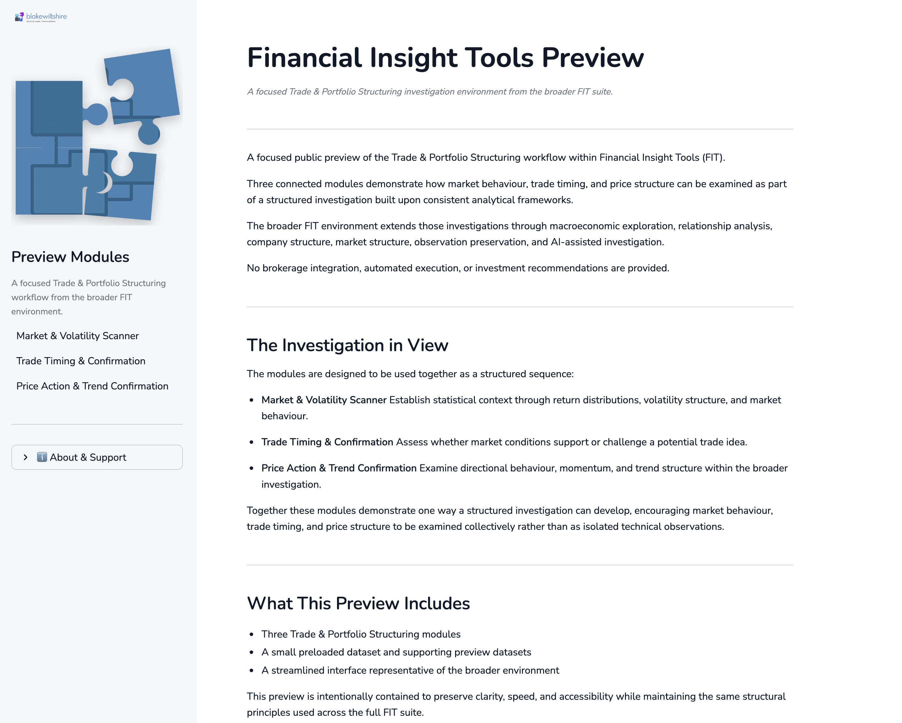
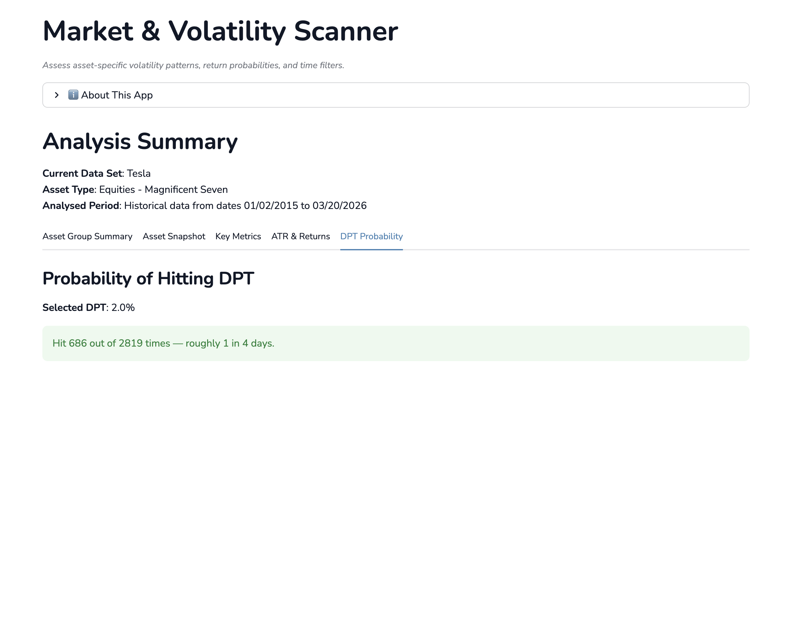
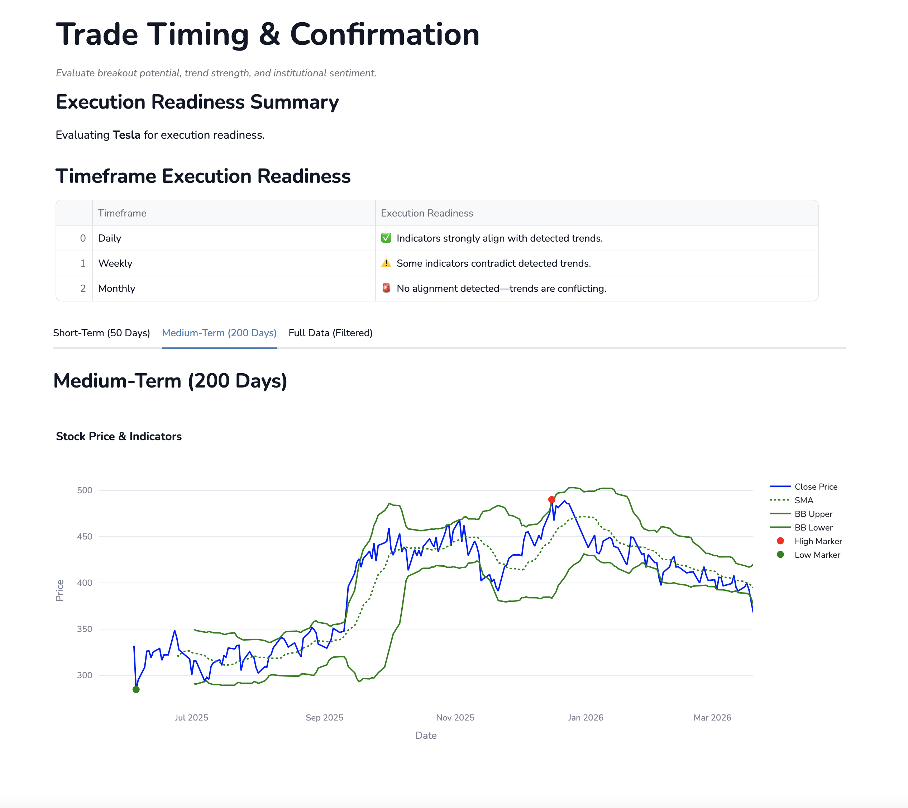
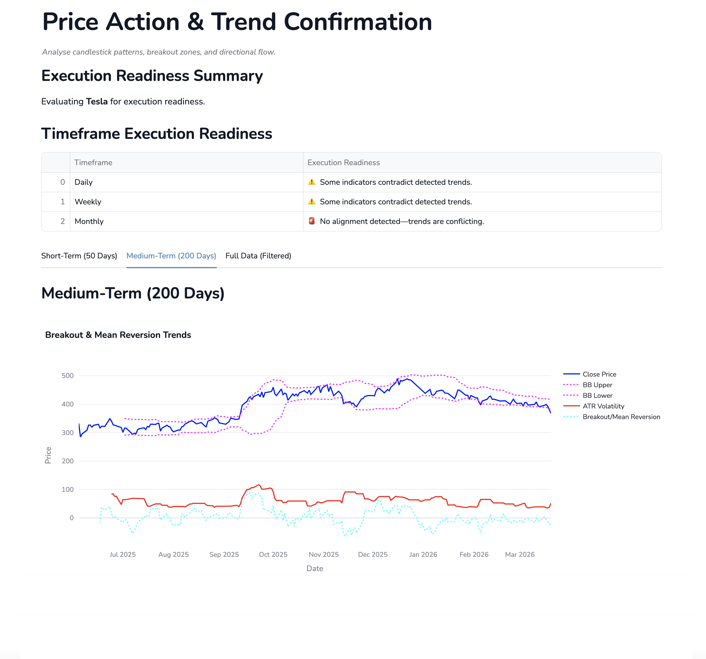

# Financial Insight Tools (FIT) — Public Preview

Financial Insight Tools (FIT) Public Preview provides access to a focused subset of the broader Financial Insight Tools investigation environment. It demonstrates how market behaviour, timing, and price structure can be explored through structured investigations while preserving the same analytical principles used throughout the full platform.

## Learn More

To understand the investigation philosophy behind Financial Insight Tools (FIT):

- [Why We Built Financial Insight Tools (FIT)](https://blakewiltshire.substack.com/p/financial-insight-tools-fit)

## Scope of This Preview

The public preview includes three integrated modules:

- **Market & Volatility Scanner**
- **Trade Timing & Confirmation**
- **Price Action & Trend Confirmation**

The dataset is restricted to a curated selection of large-cap equities and supporting preview datasets to provide a fast, stable demonstration of the wider Financial Insight Tools environment.

The preview intentionally excludes many modules available in the full platform, including company analysis, macroeconomic exploration, relationship management, investigation preservation, AI-assisted investigation, portfolio workflows, and supporting utilities.

## Relationship to the Full FIT Suite

The complete Financial Insight Tools platform extends across six connected environments:

- **Economic Exploration** — macroeconomic indicators and country-level analysis
- **Intermarket & Correlation** — thematic relationships, transmission, positioning, and cross-market analysis
- **Trade & Portfolio Structuring** — company analysis, market structure, trade planning, and portfolio workflows
- **Reference & Investigation Resources** — relationship exploration, classifications, institutional references, and supporting resources
- **Observation & AI Export** — investigation preservation, AI personas, and structured investigation bundles
- **Toolbox & Calculators** — supporting analytical and risk-planning utilities

This repository demonstrates one focused operational layer within that broader architecture while preserving the same investigation philosophy, analytical consistency, and design principles used throughout the full platform.

## What This Is (and Isn’t)

**Is:**  
A structured decision-support environment for exploring market behaviour, volatility context, trade timing, and price structure through consistent analytical frameworks.

**Isn’t:**  
A brokerage platform, automated trading system, advisory service, signal engine, or predictive model.
No trade execution or financial advice is provided.

All outputs are exploratory and structural in nature.

## Python Version

Tested on 3.12.x

## Quick Start

### 1. Clone

```bash
git clone https://github.com/blakewiltshire/financial-insight-tools-demo.git
cd financial-insight-tools-demo
```

### 2. Create a Virtual Environment

```bash
python3 -m venv .venv
```

If `python3` is not available on your system, try:

```bash
python -m venv .venv
```

### 3. Activate the Environment

**macOS / Linux**

```bash
source .venv/bin/activate
```

**Windows (PowerShell)**

```powershell
.\.venv\Scripts\Activate.ps1
```

**Windows (cmd)**

```bat
.\.venv\Scripts\activate.bat
```

### 4. Install Requirements

```bash
python -m pip install --upgrade pip
pip install -r requirements.txt
```

### 5. Run the Application

```bash
streamlit run app.py
```

The application will launch at:

http://localhost:8501

### Starting a New Session

Financial Insight Tools only needs to be installed once.

To begin a new session:

1. Open a terminal.
2. Navigate to the Financial Insight Tools project directory.
3. Activate the virtual environment.
4. Launch the application:

```bash
streamlit run app.py
```

If the virtual environment is no longer active (for example, after restarting your computer or opening a new terminal), reactivate it before launching the application.

## Screenshots


### 1. Financial Insight Tools Preview — Overview



The preview homepage establishes structural orientation and module navigation within the Trade & Portfolio Structuring workflow.


### 2. Market and Volatility Scanner



A structural view across market behaviour and volatility conditions:

- Return distribution structure
- Dispersion characteristics
- Volatility context
- Regime-sensitive framing

Provides quantitative grounding for downstream analysis.


### 3. Trade Timing and Confirmation



A structured view across timing and confirmation layers:

- Timeframe alignment
- Confirmation layers
- Entry structure
- Context-aware framing

No automated execution or signal generation is performed.


### 4. Price Action and Trend Confirmation



A structural view across price behaviour and directional context:

- Trend structure
- Momentum framing
- Pattern consistency
- Regime-aware interpretation

Outputs remain exploratory rather than prescriptive.


## Repository Structure

```text
financial-insight-tools-demo/
  app.py          # Streamlit launcher
  brand/          # Visual assets
  components/     # UX
  core/           # Shared structural logic and helpers
  data_sources/   # Data sources and cleaners
  docs/           # Reference documentation
  helpers/        # Helper files
  images/         # Application images
  pages/          # Application launcher
  use_cases/      # Use Cases
  LICENSE
  README.md
  requirements.txt
```

## License & Use

Free to read and use as provided.

All outputs are structural and exploratory in nature.  
No advisory, brokerage, portfolio management, or automated trading services are provided.

Refer to LICENSE for details.

## Ecosystem Context

Financial Insight Tools provides a structured environment where observations, evidence, and reasoning remain connected as investigations evolve. The application can be used independently, while the companion guides and articles provide additional architectural context for those exploring the wider framework.

FIT aligns with the architectural concepts presented in the *Navigating the World of Economics, Finance, and Markets* series — a structured examination of economics and finance as interconnected systems shaped by institutions, incentives, coordination mechanisms, and technological change.

The series spans six thematic areas: Foundational Knowledge, Practical Economics, Finance Fundamentals, Investment Strategies, Trading and Operations, and FinTech Innovations. Together, these areas provide a coherent framework for understanding macroeconomic structure, market dynamics, portfolio construction, and system-level behaviour.

Each guide functions as a self-contained analytical unit while aligning to a broader modular architecture that supports structured reasoning, comparative analysis, and cross-domain exploration.

The companion guides introduce the analytical frameworks and mental models that underpin the wider ecosystem. Triangular Navigation extends each guide through practical application, AI-assisted perspective testing, and decision-support tools. Financial Insight Tools provides the environment in which those concepts become structured investigations, preserving evidence, observations, and reasoning as understanding develops.

Financial Insight Tools operationalises these concepts within a structured investigation environment. The application can be used independently; the guides provide deeper architectural framing for those exploring the underlying structural model.

Further context:  
https://blakewiltshire.com


Financial Insight Tools by Blake Wiltshire  
© Blake Media Ltd.
